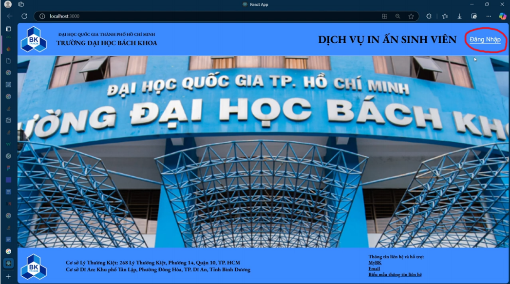
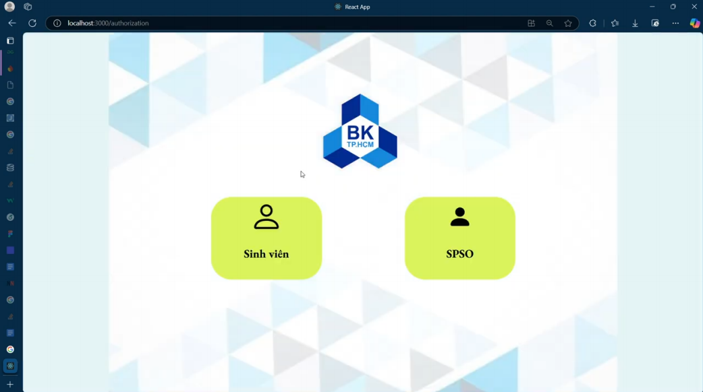
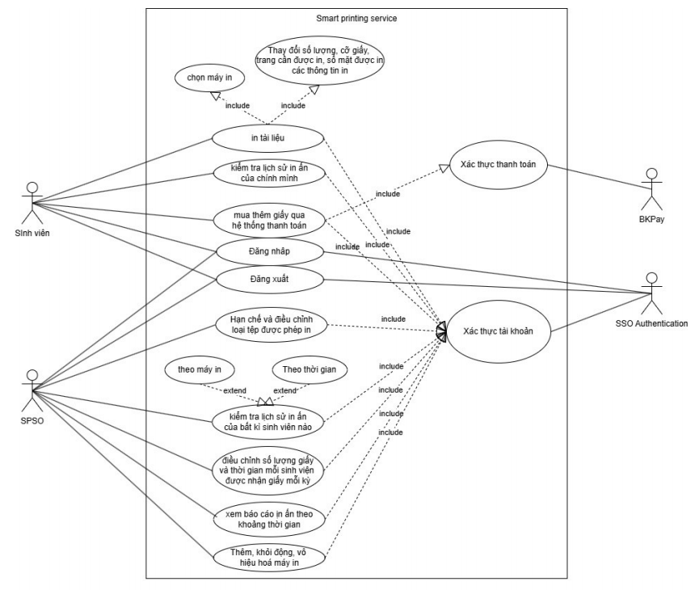
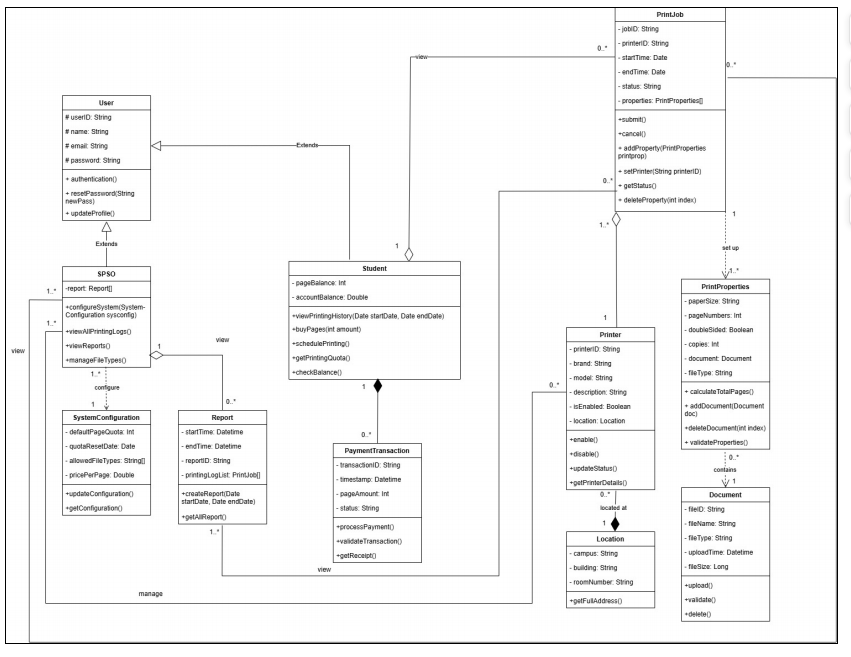

# 
**A SMART PRINTING SERVICE FOR STUDENTS AT HCMUT**

 Developed by Group 15 - L03 - HK241
 

## Table of content
- [Introduction](#introduction)
- [Technologies Used](#technologies-used)
- [Source code](#source-code)
- [Requirement Elicitation](#requirement-elicitation)
- [Use case diagram](#use-case-diagram)
- [Class diagram](#class-diagram)
- [Develop MVP 1](#develop-mvp-1)
- [Architecture design](#architecture-design)
- [Implementation](#implementation)
- [Feature Overview](#feature-overview)
- [Conclusion](#conclusion)
- [Contributors](#contributors)

## **📌Introduction**

🎓 The HCMUT-SSPS (HCMUT Student Smart Printing Service) system is designed to meet the smart printing needs of students at Ho Chi Minh City University of Technology. The project focuses on providing features such as document management, online print order placement, print job status tracking, and payment processing via the PayOS system.

🎓 The main goal of the system is to minimize waiting time and enhance the printing experience for students while ensuring seamless integration with existing payment and data management platforms.

## 🛠**Technologies Used**

The HCMUT-SSPS system is built using a modern technology stack to ensure efficiency, scalability, and user-friendliness. Below are the key technologies utilized in its development:
- Backend
  - `MongoDB` – A NoSQL database used for efficient data storage and retrieval.
  - `ExpressJS` – A lightweight and flexible Node.js framework for building the backend API.
- Frontend
  - `ReactJS` – A JavaScript library for building an interactive and responsive user interface.
- Payment Integration
  - `PayOS` – A secure and seamless online payment gateway to facilitate cashless transactions.
- Development & Design Tools
  - `Postman` – Used for API testing and development.
  - `Draw.io` – A tool for designing system diagrams and workflows.
  - `Figma` – A collaborative UI/UX design tool.
  - `GitHub` – A version control system to manage and track code changes.
This tech stack ensures that HCMUT-SSPS operates efficiently, providing a seamless experience for students while maintaining high performance and security

## 🚀**Source code:**

The source code of the software can be accessed via the following link:

🔗 [Smart Printing Service SourceCode](https://github.com/ngochidung2111/CNPM)

## 📌**Requirement Elicitation** 

### 🚀 **Context Domain and Stakeholders in the Smart Printing Service for Students at HCMUT**:

**1. Context Domain**

🎓 The Smart Student Printing Service at HCMUT (HCMUT_SSPS) is an automated system designed to meet students' document printing needs across the university’s campuses. This system provides a network of printers distributed across various buildings and classrooms, allowing students to easily access and use them. Instead of taking their documents to external printing shops, students can directly upload files to the system via a web or mobile application, select a printer near their location, and configure printing options (such as paper size, number of pages, single-sided or double-sided printing, etc.).

🎓 The system is integrated with HCMUT_SSO, ensuring that only authenticated users (students and staff) can use the printing service. Additionally, the system enables students to manage the number of pages allocated by the university each semester and purchase additional pages through the university’s online payment system (BKPay). Each student has an account to monitor their printing usage, where A3 pages are counted as double compared to A4 pages.

🎓 All printing activities are logged, including timestamps, the printer used, and the number of pages printed. The system integrates with the university’s digital services to ensure strict management of printing resources, reducing waste and improving efficiency. It also benefits administrative departments by automating monitoring and generating reports on printing service usage.

**2. Stakeholders and Their Needs in the HCMUT_SSPS System**
- Students:
  - Convenient access to printing services: Students need an easy-to-use system accessible via both web and mobile applications to upload documents, select printers, and configure printing properties (paper size, single/double-sided, number of copies, etc.).
  - Usage tracking and history management: They require a feature to review their printing history, total pages printed, and remaining print balance, allowing them to control their printing usage efficiently.
  - Purchasing additional print pages: Students need the ability to buy extra print pages (A4, A3) via online payment gateways like BKPay when their allocated print balance runs out.
  - File format support: The system must support multiple common file formats (PDF, DOCX, PPTX, etc.) to ensure smooth printing without file upload issues.
- Printing Service Management Staff (SPSO):
  - Printer system management and monitoring: SPSO staff need the ability to add, activate, or disable printers in the system. They also require real-time information on printer status for maintenance and troubleshooting.
  - Print quota and system configuration management: SPSO staff need tools to modify the default number of allocated print pages per student each semester and configure accepted file formats.
  - Monitoring and report generation: SPSO staff require features to view and export reports on students' printing history or overall system usage within a specific timeframe. These reports help in monitoring service usage and managing printing resources efficiently.
- Authentication System (HCMUT_SSO):
  - Security and authentication: The SSO system must ensure that all users, including students and SPSO staff, are securely authenticated before accessing HCMUT_SSPS. This helps protect user accounts and prevent unauthorized access.
  - Seamless integration with HCMUT_SSPS: The SSO system should integrate smoothly with HCMUT_SSPS to ensure a seamless login experience without disrupting user interaction.
  - Access control management: The SSO system must enforce clear user permissions, ensuring that students can only view and manage their documents, while SPSO staff have administrative access to manage and monitor the entire printing service.
- BKPay:
  - Integration with HCMUT_SSPS: BKPay must ensure seamless integration with HCMUT_SSPS so that students can easily purchase additional print pages without technical issues.
  - Transaction logging and verification: BKPay must accurately validate student payment transactions, ensuring correct verification of the paid amount and purchased print pages.
 
**3. Benefits of the HCMUT-SSPS System for Stakeholders**
- Students:
  - Convenient access: The system provides printing services via web and mobile applications, allowing students to access it easily from anywhere.
  - Effective management: Students can track their printing history and account balance, enabling clear cost control for service usage.
  - Financial flexibility: The ability to purchase additional print pages through online payment systems like BKPay allows students to top up pages as needed.
  - Diverse printing options: The system offers various printing settings such as paper size, number of copies, and printing mode (single-sided/double-sided) to meet individual needs.
  - Enhanced security: Authentication via the HCMUT_SSO system ensures account protection and safeguards students' personal information.
- Printing Service Management Staff (SPSO):
  - Flexible printer management: SPSO staff can easily add, activate, or disable printers, ensuring continuous and efficient operation.
  - Easy configuration adjustments: The ability to modify the default print page allocation and file format settings helps SPSO serve students better.
  - Smart monitoring and reporting: Automated tracking and reporting features allow SPSO to analyze usage history and make informed management decisions.
  - Strict resource control: SPSO can review individual student printing logs or the entire system’s usage over specific time periods, improving resource management.
- Authentication System (HCMUT_SSO):
  - User information security: The authentication system ensures that only verified users can access the service, protecting user accounts from unauthorized access.
  - Seamless user experience: Smooth integration with HCMUT_SSPS enables quick and uninterrupted login, enhancing the overall user experience.
- BKPay:
  - Increased revenue: BKPay generates income from transaction fees when students purchase additional print pages.
  - Enhanced credibility: By ensuring secure and reliable transactions, BKPay builds trust among users.
    
### 🚀 **Functional and Non-Functional Requirements of the HCMUT-SSPS System**:

**1. Functional Requirements**
- Students:
  - Select a printer to receive the document.
  - Upload document files.
  - Adjust print settings such as size, pages to print, single-sided or double-sided, and number of copies.
  - Check printing history.
  - Print documents only when sufficient pages are available.
  - Purchase additional pages through the payment system.
- Printing Service Management Staff (SPSO):
  - Restrict and adjust the types of files students are allowed to print.
  - View printing history of all students or a specific student based on date and printer.
  - Modify the number of pages allocated to students per semester.
  - View printing reports by month and year.
  - Add, start, or disable printers.
- Authentication System (HCMUT_SSO):
  - Authenticate user identity when accessing the website and assign permissions based on user type.
- BKPay:
  - Verify and confirm the payment process when students request to purchase additional pages.
  - Authenticate student transactions, verify paid amounts, and track the number of pages purchased.

**2. Non-Functional Requirements**
- Performance Requirements:
  - The system must handle multiple concurrent print requests (at least 500 requests simultaneously) without slowing response time.
  - Uploading and processing a print request should take less than 2 seconds for documents under 10MB.
  - Maximum response time must not exceed 4 seconds.
  - The system must ensure continuous printing service during peak hours, such as exam periods and semester-end.
  - Web application should use less than 300MB of RAM during operation.
- Reliability Requirements:
  - The system must log all printing activities and recover information in case of power failure or system errors.
  - The error rate in the printing process (e.g., printer failure or file errors) must not exceed 10%, ensuring a 90% success rate.
  - The system must have a backup plan to prevent service disruptions.
  - Maintenance sessions should last no longer than 20 minutes per instance, and only system owners should access the system during maintenance.
  - The system should be available from 6 AM to 8 PM, Monday to Sunday.
- Security Requirements:
  - All users must be authenticated via HCMUT_SSO before using the system.
  - All student information must be encrypted in the database and during transmission.
  - The website must comply with university regulations and legal requirements.
  - The system must log all access and operations for auditing purposes.
- Usability Requirements:
  - The user interface must be user-friendly, enabling students to easily find information and operate the printing service (97% of students should be able to use it easily with guidance).
  - New users, system staff, and admins should become proficient in using the system within 10-15 minutes, 20-30 minutes, and 35-50 minutes, respectively, after reviewing detailed instructions.
  - Video tutorials or FAQs must be provided to assist students in troubleshooting issues.
  - The system should include online support features (chatbot or email support) for timely assistance.
  - The interface should support Vietnamese and be switchable to English.
  - The system must support common file formats such as PDF, DOC/DOCX, PNG, JPEG, etc.
- Scalability Requirements:
  - The system must support adding at least 50 additional printers without reducing performance.
  - The system should accommodate 2,000 new users annually.
  - It should be expandable to include new features such as mobile payment or SMS notifications.
  - The software architecture should allow easy module upgrades without affecting other parts of the system.
- Maintainability Requirements:
  - Each system module should be designed simply and clearly for easy testing and debugging.
  - Regular maintenance should be scheduled once a month, including software updates and security checks.
  - Detailed technical documentation should be provided for system maintenance and upgrades.
- Availability Requirements:
  - The system must maintain at least 99.9% uptime, with a maximum downtime of 8.76 hours per year.
  - Continuous monitoring should be in place to detect and notify issues promptly for quick intervention.
  - The system should notify students at least one week in advance of scheduled maintenance to allow them to plan printing activities accordingly.
- Compatibility Requirements:
  - Ensure compatibility between the SSPS system and printers.
  - Ensure compatibility between the SSPS system and the HCMUT_SSO authentication service.
  - Ensure compatibility between the SSPS system and the BKPay payment system.
  - The system must function properly on major browsers such as Chrome, Firefox, Safari, and Edge, as well as on mobile operating systems like Android and iOS.
- Management and Reporting Requirements:
  - The system should automatically generate monthly reports on printing activities and usage statistics.
  - Reports must be easily accessible and customizable for administrators.

## 📌**Use case diagram** 

## 📌**Class diagram** 

The class diagram describes the print service management system, including key classes such as `User, Student, SPSO, SystemConfiguration, Report, PaymentTransaction, PrintingHistory, PrintJob, Printer, PrintProperties, Document, and Location`.
- User and Student are two main classes that extend from a base class. Users can perform actions such as `resetPassword()`, `authenticate()`, and `updateProfile()`, while Student includes additional printing-related functionalities such as `viewPrintingHistory()`, `buyPages()`, `schedulePrinting()`, and `checkBalance()`.
- SPSO (Service Printing System Operator) manages the printing system through methods like `managePrinters()`, `configureSystem()`, and `generateReports()`. This class is directly linked to SystemConfiguration, which is responsible for configuring printing quotas and allowed file types.
- PrintJob stores information about print jobs, including start time, end time, status, and printing properties. Operations on PrintJob include `submit()`, `cancel()`, `getStatus()`, and `checkBalance()`. Additionally, this class is associated with PrintProperties to manage detailed printing settings such as paper size, number of pages, and document information.
- PaymentTransaction handles student payment transactions with methods like `processPayment()`, `validateTransaction()`, and `getReceipt()`.
- Other classes such as `Location, Printer, and Document` manage information related to printers, documents, and printing locations within the system.

## 📌**Develop MVP 1** 

## 📌**Architecture design**

## 📌**Implementation**

## 📌**Feature Overview**

## 📌**Conclusion**

## 🏆Contributors